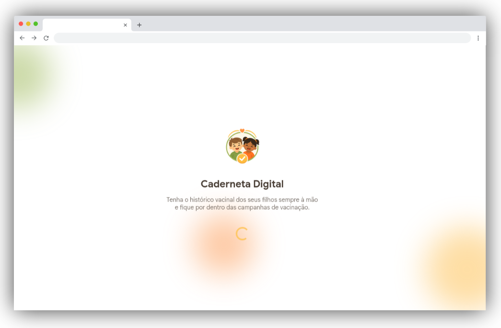

'   

    <h1>Caderneta Digital 💉​📋</h1>
    

<h4 align="center"> 
    <a href="https://caderneta-digital-nine.vercel.app/">Clique aqui para visualizar o projeto</a>
<h4>

## 💻 Sobre o projeto
Aplicação desenvolvida como solução para o acompanhamento da jornada de vacinação infantil, substituindo a dependência da carteira física e facilitando o controle por parte dos responsáveis.

O sistema foi desenvolvido utilizando **Ionic Framework com Angular**, com foco em experiência do usuário, organização de informações e responsividade.

## 🎯 Objetivo do Projeto

A proposta da aplicação é permitir que pais e responsáveis possam:

- Cadastrar e acompanhar múltiplas crianças;
- Visualizar o histórico vacinal de cada filho;
- Identificar vacinas pendentes e atrasadas;
- Acompanhar campanhas de vacinação;
- Organizar informações de forma simples e intuitiva.

## 👩🏻‍💻 Funcionalidades
### 👤 Autenticação (simulada)
- Tela de login e cadastro (fluxo sem backend)
- Persistência de usuário via `localStorage`

### 👶 Gestão de filhos
- Cadastro de filhos (nome e idade)
- Visualização de múltiplas crianças por usuário

### 💉 Controle de vacinas
- Lista de vacinas por criança
- Status:
  - ✔ Em dia
  - ⏳ Pendente
  - ⚠ Atrasada

### 📊 Dashboard
- Visão geral do sistema na Home
- Resumo dos filhos cadastrados
- Acesso rápido às funcionalidades

## 🎨 Interface

O projeto utiliza uma paleta de cores obrigatória:

- 🟢 Verde: `#ABC270`
- 🟡 Amarelo: `#FEC868`
- 🟠 Laranja: `#FDA769`
- 🟤 Marrom: `#473C33`

A interface foi pensada para ser moderna, limpa e de fácil navegação.

## 📱 Responsividade

A aplicação foi desenvolvida com foco em responsividade, garantindo boa experiência em:

- 💻 Desktop
- 📱 Smartphones
- 📟 Tablets

## 🛠️ Tecnologias utilizadas

- Ionic Framework
- Angular
- TypeScript
- HTML5
- SCSS
- LocalStorage (simulação de backend)

**Coded by [Ana Beatriz Arguelho](https://github.com/anabeatrizarguelho).**
